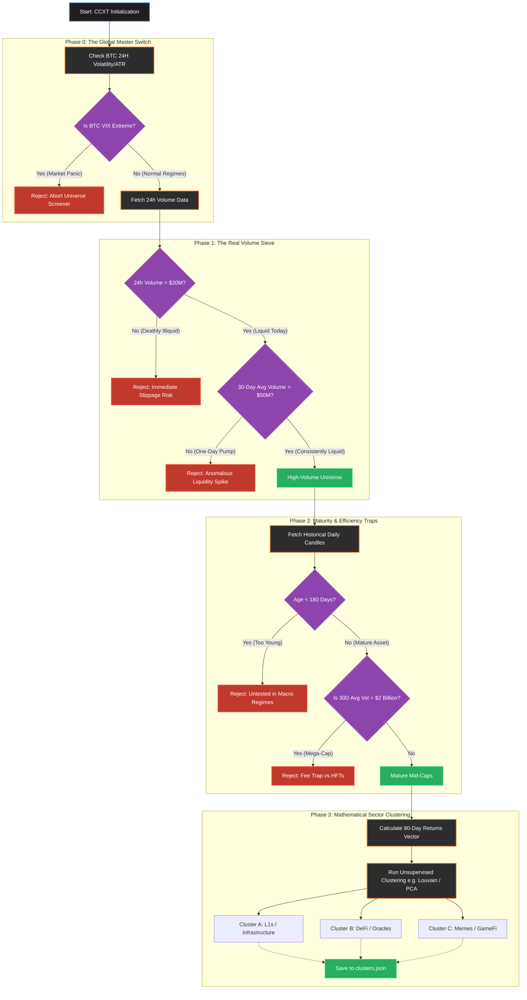

# Pipeline Blueprint: Dynamic Asset Selection

This document outlines exclusively the **Asset Selection Pipeline**. Before any trading algorithm executes, we must programmatically reduce 300+ noisy crypto perpetuals down to a mathematically proven, highly liquid, and structurally sound universe of Pairs.

## The Selection Funnel

Below is the updated pipeline architecture using Absolute Volume metrics instead of arbitrary Rank limits.



---

## Phase 0: The Global Master Switch
Before the pipeline even fetches a single Altcoin, Phase 0 looks at Bitcoin's 24-Hour volatility (ATR or VIX-equivalent).
* **The Logic:** If Bitcoin violently crashes or pumps >15% in a single day, the entire crypto market correlations skew artificially towards 1.0 due to cascading cross-asset liquidations. 
* **The Rule:** We do not want to recalculate a clustered universe during a global liquidity crisis. If the pipeline detects an extreme volatility spike, the system **aborts the active pipeline run**. It refuses to build a new set of clusters based on panicked daily candles, ensuring you only spawn new Cohorts during stable market regimes.

---

## The "180 Days" Data Maturity Rule: Explained

Is the 180-day rule arbitrary? No. 
Does it depend on the timeframe of your trading engine (e.g., 1m vs 4h candles)? **Absolutely not.**

### Market Regimes vs. Data Points
Even if you get a special 0-fee tier on an exchange and decide to execute high-frequency trades on the **1-minute chart**, you *still* cannot run a Stat-Arb engine on a coin that is only 45 days old.

1. **The Core Philosophy:** Stat-Arb (Pairs Trading) does not rely on candlestick patterns; it relies on a **structural, macroeconomic bond** between two projects. 
2. **The Flaw of Short Timeframes:** A coin that launched 45 days ago might look perfectly cointegrated with Solana on a 1-minute chart because the entire crypto market has been in a euphoric "Up-Only" bull trend for the last 45 days. Everything correlates when everything goes up.
3. **The Acid Test:** What happens when the Federal Reserve suddenly hikes interest rates? What happens during a violent weekend flash crash where liquidity vanishes? If the coin hasn't been alive for at least 180 days (ideally hitting a macro flush or a boring chop season), your algorithm has absolutely zero statistical proof that the pair will *stay* cointegrated under stress. 

By demanding 180 days of historical existence, you are computationally guaranteeing that the statistical bond between the pair is rooted in fundamental market mechanics, rather than just being a temporary byproduct of a 30-day hype cycle. 

---

## Execution Autonomy (Historical Cohorts)

The Universe Screener's only job is to calculate the structural taxonomy of the market based on massive 90-day datasets. 

When the pipeline finishes, it exports a timestamped file (e.g., `clusters_2026-03-30.json`) to the database and halts. This allows you to run the Screener dynamically whenever you have free capital, without the AI "mid-week re-clustering" destroying the mathematical cohorts of your currently open live trades!

---

### Mathematical Filtering of Mega-Caps
You never want to hardcode `["BTC", "ETH", "XRP"]` into your exclusion list. Hardcoding is fragile. Instead, you filter them out computationally using **Volume Ceilings** or **Rank Percentiles**.

Since Mega-Caps like Bitcoin and Ethereum process absolutely colossal amounts of volume compared to the rest of the market, you can simply establish a secondary filter:
* **The Ceiling Filter:** Identify the 30-Day Average Volume for the asset. If the Average Daily Volume is greater than **$2 Billion**, reject it seamlessly. 
* **The Slicing Method:** After querying Binance for all active pairs, sort the entire dictionary by `30_day_avg_volume` in descending order. Then, simply slice the python array: `valid_pairs = all_pairs[5:]`. By computationally dropping indices 0 through 4, you instantly bypass the top 5 most liquid mega-cap coins on earth without ever typing their tickers.


# V2 Python Architecture: Universe Screener

This document represents the absolute source-of-truth for the Python engineering of the Universe Screener. To maintain institutional-grade quality, the architecture formally enforces **Separation of Concerns**, **Dependency Injection**, and **Local Caching** to protect API rate limits and isolate mathematical environments.

---

## 1. Directory Structure (The Data Flow)

```text
/root
│
├── src/
│   ├── data/                         # [THE MUSCLE] Network & Storage Layer
│   │   ├── fetcher/
│   │   │   └── binance_client.py     # Sole file allowed to `import ccxt`
│   │   │
│   │   └── storage/
│   │       └── local_parquet.py      # Caches API responses to disk to prevent Rate Limits
│   │   
│   └── screener/                     # [THE BRAIN] Math & Logic Layer
│       ├── __init__.py
│       ├── config.yml                # Hardcoded threshold limits (e.g., min_vol: 20_000_000)
│       ├── pipeline.py               # Main Orchestrator (Dependency Injector)
│       │
│       ├── filters/                  # Pass/Fail Sieves (Agnostic to CCXT)
│       │   ├── __init__.py
│       │   ├── regime_switch.py      # Computes VIX logic from injected dataframe
│       │   ├── volume_liquidity.py   # Computes Rank/Slicing from injected dictionary
│       │   └── data_maturity.py      # Computes continuous days logic from injected dataframe
│       │
│       ├── clustering/               # Heavy Machine Learning Math
│       │   ├── __init__.py
│       │   ├── returns_matrix.py     # Takes cached K-Lines -> Builds log-returns matrix
│       │   └── graph_louvain.py      # NetworkX community detection implementation
│       │
│       └── exporter/                 
│           ├── __init__.py
│           └── cohort_builder.py     # Safely writes final dict to clusters_YYYYMMDD_HHMM.json
│
├── tests/
│   ├── data/
│   │   └── test_binance_client.py    # Tests API limits/retries with unittest.mock
│   └── screener/
│       ├── test_regime_switch.py     # Injects fake crashed BTC DataFrames
│       ├── test_volume_liquidity.py  # Injects fake dictionaries with $10M vs $50M volumes
│       ├── test_data_maturity.py     # Injects DataFrames with missing rows (179 vs 180 days)
│       ├── test_graph_louvain.py     # Injects pure synthetic Correlation Matrices
│       └── test_pipeline.py
```

---

## 2. Institutional Architectural Rules

### 1. Separation of Concerns (The CCXT Ban)
The `screener/` module is mathematically pure. **No file inside `src/screener/` is allowed to `import ccxt`.** 
If the Volume Filter needs to check the 24H volume of the market, it calls `src.data.fetcher.binance_client.get_24h_tickers()`. This guarantees that if you migrate from Binance to Bybit tomorrow, the entire `screener/` module requires exactly zero lines of code changed. 

### 2. Dependency Injection (The Config)
Modules like `data_maturity.py` do not read the `config.yml` file themselves. 
The Orchestrator (`pipeline.py`) reads the YAML once at startup, and injects the parameters into the class constructors. 
*(e.g., `sieve = DataMaturityFilter(min_days=180)`).* 
This makes Unit Testing trivially easy because tests can bypass YAML entirely and instantiate test objects on the fly: `test_sieve = DataMaturityFilter(min_days=5)`.

### 3. Local Caching & Memory Profiling (The Parquet Engine)
During Phase 2 (Data Maturity), the pipeline checks if the surviving 40 tokens have 180 days of history. During Phase 3 (Clustering), the AI needs 90 days of returns for those exact same tokens.
If we fetched from Binance twice, we would be immediately IP-banned for spam. 
Instead, `pipeline.py` tells `src.data` to fetch **200 days of history once**, save it to RAM/Parquet (via `storage/local_parquet.py`), and then passes that exact same cached `pandas.DataFrame` into both the Maturity filter and the Returns Matrix builder.

**The Performant Metadata Pattern:**
We strictly mandate retaining the highly-optimized `.parquet` schema previously built leveraging `pyarrow`.
Unlike CSVs, Parquet files store custom metadata objects in their schema headers. Whenever the fetcher pulls new K-Lines, it injects custom dictionary fields into the Parquet schema: `{'start_date': ..., 'end_date': ..., 'rows': ...}`. 
When the Engine needs to know if we already have the requested 90-days of data for `AVAX`, it reads *strictly the kilobyte-sized metadata header*. It does not load a 500MB pandas DataFrame into RAM just to check timestamps. This ensures ultra-fast disk reads and zero RAM spikes during the Universe generation.

---

## 3. Module Specifications (`src/screener/`)

### The Filters Module
1. **`regime_switch.py`**
   * **Behavior:** Accepts a BTC DataFrame injected by the Orchestrator. Calculates `ATR` or trailing volatility. If `current_volatility > threshold`, raises `RegimePanicException` to abort the pipeline.
2. **`volume_liquidity.py`**
   * **Behavior:** Accepts a dictionary of all active perpetuals. Executes the `$20M` daily rule and the `$50M` 30-day average rule. Implements the mathematical **slicing method** to drop the Top 5 Mega-Caps (discarding BTC/ETH algorithmically).
   * **Output:** A strict `List[str]` of surviving token symbols.
3. **`data_maturity.py`**
   * **Behavior:** Iterates over the raw continuous DataFrames injected by the cache. Computes exactly how many continuous daily closes exist without NaN gaps. Drops any symbol `< 180` days.

### The Clustering Module (Pipeline A: The Taxonomist)
1. **`returns_matrix.py`**
   * **NaN Eradication Mandate:** Assets with suspension gaps or $> 5\%$ `NaN` values must be strictly dropped.
   * **Transform:** Converts closing prices into **Log-Returns ($ln(P_t) - ln(P_{t-1})$)**.
   * **Winsorizing:** Actively clips extreme outlier returns at the 1% and 99% percentiles to prevent isolated pump-and-dumps from permanently distorting the taxonomy of the subsequent 90 days.
2. **`graph_louvain.py`**
   * **Behavior:** Ingests the Winsorized Log-Returns matrix. Calculates the **Spearman Rank Correlation** matrix (not Pearson, as Spearman is robust against crypto noise). Converts it into a `networkx` Graph and runs the Louvain algorithm to map the asset communities.

### The Mathematical Filter (Pipeline B: The Execution Engine)
3. **`cointegration_mesh.py`**
   * **The Bifurcation Mandate:** Cointegration is NOT taxonomy; it dictates the exact real-world Capital Hedge Ratio. This test must throw away the winsorized dataset and strictly ingest raw **Natural Log Prices ($ln(P)$)** for the clustered pairs. Mutilating the tails of the price distributions would create false integration stationarity ($I(0)$ positives) and leave the portfolio exposed to extreme Beta Drift in production.
   * **Behavior:** Runs Engle-Granger (ADF on OLS residuals) bidirectionally over the raw data. It structurally eliminates any clustered pairs that fail $P-Value < 0.05$ historically before handing them to the exporter.

### The Exporter Module 
1. **`cohort_builder.py`**
   * **Behavior:** Serializes the Louvain dictionary. Generates a precise UTC string. Combines them into a JSON payload and safely writes it to `data/universes/clusters_YYYY-MM-DD_HHMM.json`. This physical file ensures active trades in the Execution Engine are completely isolated by their specific Historical Cohorts.
