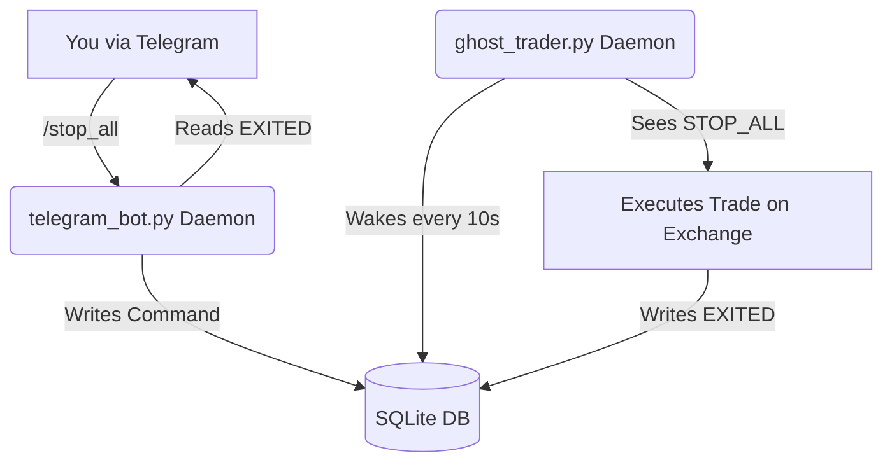

# Telegram Integration Architecture (Two-Way Interactive)

As the Epoch 3 Ghost Trader and Epoch 4 Production Trader operate autonomously in the cloud, human visibility and manual override intervention become paramount. SSHing into the VPS is sufficient for debugging, but unacceptable for active monitoring or emergency liquidation.

We will integrate a **Two-Way Telegram Interactive Bot** capable of pushing notifications and receiving manual override commands (e.g., `/status`, `/stop_all`).

## Strategy: The Decoupled Database Pipeline

The **Golden Rule** of trading infrastructure: *The UI (Telegram) must NEVER block or crash the execution backend.*

If we run the complex Telegram Long-Polling listener inside our core 4H trading loop, any network drop or Telegram API crash will take down the entire trading engine. 

To solve this, we will implement **Option A: Decoupled SQLite Polling**:
1. **The Executive Engine (`ghost_trader.py`)**: Runs the quantitative logic. Instead of sleeping for 4 hours straight, it sleeps in 10-second micro-chunks. Every 10 seconds, it checks a local SQLite table (`user_commands`) for emergency overrides.
2. **The Telegram UI (`telegram_bot.py`)**: A totally separate background daemon. It handles all the messy networking with Telegram. When you send `/status`, it reads the SQLite database locally and replies. When you send `/stop_all`, it simply writes `COMMAND: STOP_ALL` to the database and lets the Executive Engine handle the actual trading closure.



---

## 1. Supported Interactive Commands

The bot will respond elegantly to the following slash-commands:

* `/status` — Instantly returns 1) System Uptime, 2) Total PNL, 3) Count of Open Spreads.
* `/positions` — Returns a cleanly formatted list of every actively held spread and its *current* Unrealized PNL.
* `/stop <PAIR>` — Forces an emergency market liquidation of a specific spread (e.g., `/stop BTC/USDT`).
* `/stop_all` — The nuclear option. Liquidates the entire portfolio to USD instantly.
* `/pause` - Temporarily halts the bot from taking *new* trades at the next 4H candle, but maintains current ones.
* `/resume` - Lifts the pause.

---

## 2. Infrastructure Setup

### Variables required:
1. `TELEGRAM_BOT_TOKEN`: The API key provided by BotFather.
2. `TELEGRAM_CHAT_ID`: Your personal chat ID, ensuring the bot *ignores* commands from anyone else!

### CI/CD Segregation:
These variables will be added to the **GitHub Environments** (`ghost-trader`). The Bootstrap action injects them securely into the `.env` file. We will update the Bootstrap script to launch *two* systemd services: `ghost-trader` and `ghost-telegram`.

---

## 3. Code Implementation Blueprint

### `src/engine/ghost/state_manager.py` (The Bridge)
We will add a new table `user_commands` to the existing SQLite trades database.
The `GhostStateManager` will gain methods to `write_command()` and `pop_pending_commands()`.

### `scripts/telegram_bot.py` (The Interactive Daemon)
We will introduce `python-telegram-bot` to handle the interactive loops.
- Runs infinitely as a separate process.
- Strictly verifies `if message.chat_id != TELEGRAM_CHAT_ID: return` to prevent malicious strangers from controlling your bot!

### `scripts/ghost_trader.py` (The Executive Daemon)
We will restructure the `await asyncio.sleep(seconds_until_next_candle)` logic:
```python
while True:
    seconds_left = seconds_until_next_candle()
    
    # 1. Did we hit the 4H candle boundary?
    if seconds_left <= 0:
        await execute_tick(pairs, state)
        
    # 2. Did the user issue an emergency command?
    commands = state.pop_pending_commands()
    for cmd in commands:
        if cmd == "STOP_ALL":
            await execute_emergency_liquidation(state)
            
    # 3. Sleep in safe 10-second chunks instead of 4-hour chunks
    await asyncio.sleep(min(10, seconds_left))
```

---

## 4. Multi-Environment Bot Isolation Strategy

To ensure zero-crossover risk between testing environments and live capital, the architecture strictly mandates **Environment Isolation**. Under no circumstances should a single Telegram Bot interact with multiple trading environments. 

The strategy utilizes a dedicated Telegram Bot token per environment, ensuring absolute safety:

### 🌱 DEV: Local Turbo Bot (`@Lucas_TurboBot`)
- **Environment:** Local Mac (Developer Machine).
- **Execution:** `python -m scripts.ghost_trader --turbo`
- **Data Source:** `data/ghost/turbo_trades.db` (1-Minute Candles).
- **Purpose:** Fast prototyping, testing code refactors, and confirming system stability without affecting production databases. Any `/stop_all` command sent here never impacts the VPS.

### 👻 UAT: VPS Ghost Bot (`@Lucas_GhostBot`)
- **Environment:** Oracle Cloud VPS (Quarantined Sandbox).
- **Execution:** Managed by `systemd` daemon `ghost-trader.service`
- **Data Source:** `data/ghost/trades.db` (4-Hour Candles).
- **Purpose:** Epoch 3 Paper-Trading validation. The system simulates exact capital fluctuations over a 1-month forward test proving strategy alpha. 

### 💰 PROD: VPS Capital Bot (`@Lucas_CapitalBot`)
- **Environment:** Secure Oracle Cloud VPS.
- **Execution:** Live Bybit Trading Engine (Epoch 4).
- **Data Source:** Live Exchange API + Real Capital SQLite logs.
- **Purpose:** Real-money execution. This bot holds exclusive permissions to trigger physical `/stop_all` liquidate market orders across Live Bybit API connections.

Each environment is configured by passing the specific bot's `TELEGRAM_BOT_TOKEN` into the local `.env` or GitHub Secrets variables corresponding to the deployment layer.
