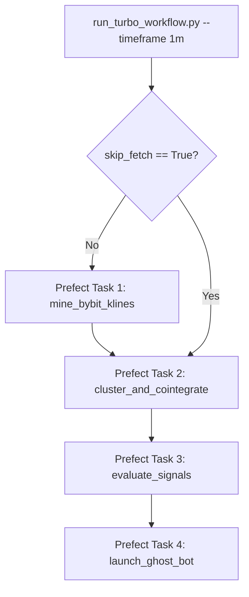

# Institutional E2E Data Orchestration (Prefect & Architecture Scaling)

As the execution platform migrates towards actual cloud-based paper trading and eventually live capital, the local "Turbo Sandbox" architecture must be fundamentally redefined. Running 1-minute live tick validations based on parameters optimized over 4-hour mathematical horizons injects pure statistical noise rather than edge.

To remediate this, we are abandoning "Frankenstein Testing" and building a mathematically pure, End-to-End Orchestration framework.

## 1. Prefect: Python Native Workflow Orchestration

Industry-standard Data Engineering relies heavily on DAG (Directed Acyclic Graph) architectures to verify state dependency. We introduce **Prefect**, an immensely lightweight, Python-native orchestrator.

### Why Prefect?
Instead of creating brittle `subprocess.run()` python automation scripts, Prefect allows native function chaining and state monitoring safely. By simply adding `@task` decorators, Prefect automatically builds a resilient DAG.
* **Granular Control (`Dirty Runs`)**: Passing an argument like `--skip-fetch` allows the Prefect orchestrator to skip API-expensive tasks natively, picking up perfectly from `Task 2` using cached historical disk frames.
* **Automatic Backoffs:** Native arguments handle CCXT network drops natively, retrying explicitly.

## 2. Bybit Native Ingestion & "Mathematical Freeze-Frame"

The previous iteration relied on Binance historical sweeps to feed the Cointegration models, which Ghost Trader then executed against Bybit. This created massive Exchange slippage differentials since Binance spreads are inherently different than Bybit spreads!

### Resolution
1. **CCXT Bybit Inbound**: We will replace Binance completely for our datasets, natively executing paginated requests against `bybit`.
2. **The 300-Coin Drift Dilemma:** Scraping 300 coins on `1m` timeframes takes physically > 2 minutes. Coin `A` ends at `:00` and Coin `Z` ends at `:02`, meaning cross-sectional correlation matrices fracture.
   - **Fix -> Mathematical Freeze-Frame:** The Prefect orchestrator captures a singular global variable `END_TIMESTAMP = int(now.timestamp())` when the flow begins. It explicitly passes this specific freeze-frame down to `bybit_client.py`, natively amputating any newer candle data so all vectors resolve identically at standard length.

## 3. Horizon Parameter Scaling (1m vs 4h)

Hardcoding `-lookback=14` explicitly assumes `14 days`. On a 4-H timeframe, `14*6 = 84 bars`. On a 1-Minute timeframe, `14 * 1440 = 20,160 bars`! We will refactor the ingestion engines to dynamically calculate necessary lookup boundaries predicated purely on the requested `--timeframe`.

### Architecture Flow (`scripts/run_turbo_workflow.py`):

## 4. Strict Environment Directory Scopes

With multi-environment capabilities introduced via Telegram, Data Pollution locally needs immediate quarantine. Any testing artifacts must never be tracked by GitHub or crash the Cloud execution layer.

`data/parquet/{TF}` 
`data/universes/{TF}` 
`data/ghost/{TF}`

All variations correctly append their Timeframe wildcards, ensuring Production (`4h`) datasets are mathematically quarantined from Sandbox (`1m`) datasets indefinitely.
