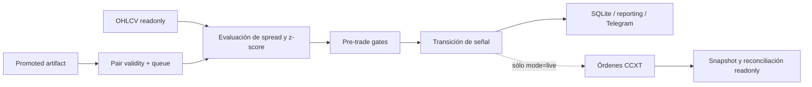

# Auditoría de reingreso al proyecto

**Fecha del análisis:** 2026-07-17

**Commit versionado auditado:** `adefd2db` (`main`, 2026-06-10)

**Cambio local preservado:** `TODO` modificado, sin commit

**Objetivo usado para priorizar:** conseguir primero un bot local confiable con
dinero simulado; recién después habilitar demo/testnet y, bajo un gate separado,
capital real.

> **Tipo de documento:** snapshot fechado, no fuente de estado continuamente
> actualizada. Conserva la evidencia encontrada el 2026-07-17. Para el estado y
> el orden de trabajo vigentes prevalecen `system-design.md` y
> `current-roadmap.md`.

## Conclusión ejecutiva

El proyecto no está perdido ni necesita ser reescrito. Tiene una arquitectura
razonable, configuración tipada, buena separación entre research y ejecución,
persistencia SQLite cuidada, artifacts con promoción manual y una suite offline
amplia. Tampoco existen los megaarchivos de 800 líneas que preocupaban: el mayor
archivo productivo tiene 442 líneas y los archivos grandes más importantes son,
en general, cohesivos.

Pero hoy **no hay todavía un paper trader real** y el sistema **no es apto para
dinero real**. El modo `state_only` observa señales y muta un ledger local, pero
no simula fills, fees, funding, slippage, órdenes parciales ni restricciones
reales del mercado. Además, el workspace actual no conserva el artifact
promovido, la base SQLite ni las velas utilizadas en los drills de mayo: sólo
queda un probe de volumen. Por lo tanto, el camino local debe comenzar con un
cold start reproducible.

Los problemas prioritarios no son cosméticos:

1. El nombre de los swaps puede corromperse al pasar de CCXT a Parquet y volver.
2. La selección de universo no se preserva explícitamente entre descarga y
   discovery; archivos viejos pueden volver a entrar al research.
3. Pausar el trader también pausa las salidas; datos inválidos se interpretan
   como señal `FLAT` y pueden cerrar posiciones.
4. Un refresh/promoción puede dejar posiciones abiertas huérfanas o cambiarles
   el contrato estadístico mientras siguen abiertas.
5. La cointegración validada puede no corresponder al spread que luego se opera.
6. El stress test tiene look-ahead, funding dependiente erróneamente del
   timeframe y selección completamente in-sample.
7. Los “pesos” de la señal se envían como cantidades de activo. No existe sizing
   basado en equity/notional real.
8. El estado local se confirma antes de conocer los fills y se ignoran fallas o
   partial fills de las dos piernas.

La decisión pragmática es, entonces:

- **No** hacer una refactorización general.
- **Sí** reparar primero el contrato cold-start → research → review → promote →
  replay/paper local.
- **Sí** corregir después la validez estadística mínima antes de usar resultados
  para elegir pares.
- **No** habilitar `live` hasta completar un gate específico de ejecución,
  riesgo, reconciliación y recovery.

El plan accionable y acotado está en
[`current-roadmap.md`](current-roadmap.md).

El recorrido visual de cold start, execution boot y runtime loop está en
[`TRADING_SYSTEM_FLOW.md`](TRADING_SYSTEM_FLOW.md).

## Qué se auditó y cómo

Se revisaron:

- 154 módulos Python en `src/`, 16.206 líneas.
- 68 módulos Python bajo `tests/` —66 archivos `test_*.py`—, 12.395 líneas.
- entrypoints, configuración de dev/UAT/prod, workflows, documentación,
  artifacts y estado local disponible.
- historia reciente de Git y las dos versiones de `TODO`: la versionada y la
  modificación local actual.
- límites entre research, market data, exchange, ejecución, estado, reporting,
  Telegram y simulación.
- metodología de cointegración, construcción de spread, sizing, timing de
  señales, costos, funding y selección de parámetros.

Verificaciones ejecutadas sin mutar exchange ni descargar mercado:

```text
.venv/bin/python -m pytest -q
398 passed, 12 deselected

.venv/bin/ruff check src tests main.py
All checks passed

.venv/bin/python -m pip check
No broken requirements found
```

Los 12 tests excluidos son probes marcados `live`; `pytest.ini` los excluye por
defecto. También se ejecutó el scanner de calidad del repositorio. Sus 4 señales
`Blocker` y 2 `High` resultaron falsos positivos de una allowlist desactualizada;
las señales por tamaño y complejidad sí se usaron como puntos de inspección, no
como conclusiones automáticas.

No se imprimieron secretos ni se llamaron APIs privadas. `.env` está ignorado
por Git; las credenciales readonly parecen configuradas y las live no. El archivo
local tiene permisos `0644`, que conviene reducir antes de compartir la máquina o
usar capital.

## Qué fue lo último que estabas haciendo

La memoria de “cointegración” es parcialmente correcta, pero el último trabajo
versionado fue más amplio y posterior.

| Fecha | Evidencia | Qué significa |
|---|---|---|
| 2026-05-31 | `1bbfb69f` | Primer replay determinista de señales, todavía sin estado/fills/riesgo completos. |
| 2026-06-04 | `8b710948` | Se documentó el plan grande de mejoras del trader. |
| 2026-06-06/08 | `bc1deaa4`, `089ebb5f` | Se separaron límites de data/execution y se tiparon mejor exchange/universe. |
| 2026-06-09/10 | `dd400503`, `5ae5ca64` | Se refinó y documentó el filtrado de universo/liquidez. |
| 2026-06-10 | `adefd2db` | Se agregó la primera política de lifecycle de market data. Es el HEAD actual. |
| 2026-06-13 | `TODO` local | Se reemplazó el plan largo por notas de cointegración y, sobre todo, por el diseño de refresh/reuse/freshness/retention. |

La lectura más fiel es:

> Estabas intentando convertir una serie de backfills y refreshes ad hoc en un
> lifecycle de research explícito, mientras evaluabas si valía la pena mejorar
> los estimadores y tests de cointegración.

Ese trabajo quedó a mitad de camino. `DataLifecycleConfig` ya declara retención,
freshness y cleanup, pero `master_flow.py` sólo usa `retention.keep_days` como
límite del backfill. `on_stale`, las ventanas de freshness y el cleanup no
participan todavía del flujo. Las cuatro “clocks” escritas en `TODO` son una
buena formulación y deben conservarse.

El `TODO` local se dejó intacto. La versión anterior no se perdió: sigue en Git
en `8b710948^..8b710948` y no hace falta restaurarla como archivo activo.

## Qué producto existe hoy

El sistema implementa una estrategia de pairs trading sobre mercados cripto,
principalmente swaps lineales, dividida en dos planos.

### Plano de research

```mermaid
flowchart LR
    A[Exchange público / OHLCV] --> B[Selección de universo]
    B --> C[Parquet + metadata]
    C --> D[Returns y grafo de correlación]
    D --> E[Clusters Louvain]
    E --> F[Cointegración y hedge ratio]
    F --> G[Candidate artifact]
    G --> H[Stress grid vectorizado]
    H --> I[Candidate stress-evaluated]
    I -->|revisión manual| J[Promoted artifact]
```



`main.py research` llama a `src/pipeline/master_flow.py`. El flujo esperado es:

1. Resolver venue, market profile y lifecycle.
2. Listar y filtrar símbolos por mercado, historial, precio y liquidez.
3. Descargar OHLCV a Parquet.
4. Construir returns y un grafo de correlaciones.
5. Agrupar activos con Louvain.
6. Buscar pares cointegrados dentro de cada cluster.
7. Escribir un candidate artifact.
8. Probar una grilla de estrategia/costos y volver a escribir el candidate.
9. Requerir `main.py promote-pairs` para publicar el artifact consumible.

Research está diseñado para ser read-only respecto del exchange. Eso es
correcto y debe mantenerse.

### Plano de ejecución



`main.py execute` carga configuración tipada y sólo acepta dos modos:

- `state_only`: evalúa velas, señales, queue y riesgo; abre/cierra posiciones en
  SQLite, pero no genera fills ni órdenes reales.
- `live`: además construye un adapter de órdenes CCXT con credenciales live.

Dev, UAT y prod están configurados actualmente como `state_only`. Esto evita
mutación accidental, aunque que el archivo se llame `prod.yml` no significa que
el sistema esté production-ready.

### Estrategia implementada

Para cada par:

1. Se alinean los closes de las dos piernas.
2. Se calcula un spread canónico con un `beta` guardado en el artifact.
3. Se normaliza con media y desvío rolling para producir un z-score.
4. Un z-score extremo abre `LONG_SPREAD` o `SHORT_SPREAD`.
5. La reversión hacia el umbral de salida produce `FLAT` y cierre.
6. Las piernas reciben pesos inverse-volatility.

El punto 6 no es coherente aún con la ecuación de hedge del punto 2: el spread
señaliza con `beta`, mientras PnL y sizing usan pesos inverse-volatility sin
preservar necesariamente esa exposición. Antes de evaluar rentabilidad hay que
definir una convención única: beta-neutral, dollar-neutral o volatility-targeted,
y usarla desde research hasta fills.

### Componentes principales

| Componente | Ubicación | Responsabilidad actual | Estado |
|---|---|---|---|
| CLI y orquestación | `main.py`, `src/pipeline/` | Research, execute, promoción y kill switch | Útil; textos “Live” son confusos en `state_only` |
| Exchange config | `src/exchange/config/` | Venue, credenciales y perfil CCXT | Buena separación |
| Market data | `src/exchange/data/`, `src/data/` | Fetch readonly, Parquet, metadata, backfill/refresh | Varias piezas sólidas; lifecycle incompleto |
| Universe | `src/universe/` | Filtros, grafo, clustering, symbol pool | Handoff y símbolos requieren corrección |
| Estadística | `src/engine/analysis/` | Cointegración, beta y half-life | Contrato estadístico inconsistente |
| Research | `src/research/` | Candidate y stress filter | In-sample; usa simulador antiguo |
| Artifacts | `src/engine/trader/runtime/artifacts/` | Candidate/promoted y auditoría | Buen patrón; contrato demasiado permisivo |
| Señales | `src/engine/trader/signals/` | Spread, z-score y acción | Reutilizada por replay; falta no-data/stop-loss |
| Queue/validity | `src/engine/trader/runtime/` | Elegibilidad y priorización de entradas | Buena observabilidad; natural-exit roto en restart |
| Riesgo | `src/engine/trader/runtime/risk/` | Gates de exposición, precisión, liquidez y kill switch | Unidades no representan capital real |
| Estado | `src/engine/trader/state/` | Posiciones, piernas, eventos, comandos, runs | SQLite robusto; falta lifecycle de órdenes/fills |
| Reconciliación | `src/engine/trader/reconciliation/` | Comparación readonly local/exchange | Diagnóstica; no falla cerrado y agrega mal símbolos compartidos |
| Reporting | `src/engine/trader/reporting/` | Snapshots, métricas y terminal | Amplio y útil; no prioritario refactorizar |
| Telegram | `src/interfaces/telegram/` | Comandos y notificaciones | Suficiente para local privado; no es un login completo |
| Simulación | `src/simulation/` | Motor vectorizado legado + replay determinista | Replay es la dirección correcta; aún no es paper |

## Estado material del workspace

La documentación de mayo describe artifacts y una DB local que ya no están en
este checkout. Hoy `data/` contiene solamente:

```text
data/test/live_volume_filter_probe/.../live_volume_filter_probe.jsonl
```

No hay en el workspace:

- OHLCV local de los símbolos promovidos.
- candidate ni promoted pair artifact.
- base de datos dev de posiciones.
- evidencia reproducible de los drills listados en el roadmap viejo.

No es necesariamente un error: esos datos pueden haberse limpiado
intencionalmente. Sí significa que cualquier runbook que asuma esos archivos
está desactualizado y que la primera prueba útil debe arrancar desde cero usando
los CLI soportados.

Además, el lifecycle default tiene `keep_days: 5`, mientras UAT/prod piden 365
días históricos. `master_flow.py` rechaza explícitamente esa combinación. Hoy
un research con esos perfiles parece fallar antes de empezar. Hace falta un
lifecycle por ambiente o validación cruzada de todos los configs versionados.

## Lo que está bien y conviene preservar

### Arquitectura y seguridad por defecto

- Los YAML se convierten en modelos Pydantic estrictos con `extra="forbid"`.
- Market data y ejecución mutante tienen adapters separados.
- El adapter live sólo se construye con modo y credenciales live explícitos.
- Research no tiene por qué tocar órdenes ni cuenta.
- Candidate y promoted son artifacts diferentes y la promoción es manual.
- La queue y la recalibración están concebidas como gates de nuevas entradas.
- El kill switch durable también está concebido como entry-only, preservando
  salida natural.

### Estado y auditabilidad

- SQLite activa WAL, foreign keys y `synchronous=FULL`.
- Las aperturas/cierres locales multi-tabla usan transacciones.
- Existen eventos de posición, pierna, órdenes, comandos, observer runs y
  reconciliación.
- Los block reasons de queue y pre-trade se exponen al operador.
- La reconciliación se mantuvo deliberadamente read-only.

### Ingeniería

- 398 tests offline pasan y 12 probes de red quedan fuera por defecto.
- Ruff está verde.
- El fetch runtime tiene timeout, retry acotado y cache por tick.
- El replay nuevo usa la política compartida de señal y rechaza datos futuros
  que entregue el provider.
- La estructura de paquetes tiene ownership reconocible y no presenta ciclos
  obvios.

Estas fortalezas justifican evolucionar el sistema actual en lugar de
reemplazarlo.

## Hallazgos prioritarios para lograr un bot local real

### P0. La identidad del símbolo se pierde en Parquet

`src/data/storage/local_parquet.py` convierte separadores del símbolo a `_`.
`src/universe/symbol_pool.py` reconstruye cada `_` como `/`. Para un swap CCXT:

```text
BTC/USDT:USDT -> BTC_USDT_USDT.parquet -> BTC/USDT/USDT
```

Los tests cubren símbolos simples y no capturan el contrato real de swaps. El
símbolo debe leerse de metadata versionada, no inferirse del filename. Hasta
corregirlo, research → artifact → runtime puede no ser ejecutable en el mercado
para el que fue diseñado.

### P0. El universo seleccionado no se entrega al discovery

`task_mine_data` obtiene un `UniverseSelectionResult`, pero devuelve sólo
`True`. Luego `task_discover_alpha` escanea todos los Parquet del directorio.
Consecuencias:

- símbolos rechazados en el filtro actual pueden reingresar desde archivos
  viejos;
- cambios de profile/quote pueden mezclarse;
- cleanup y retention pasan a influir implícitamente en qué se investiga;
- el hardcode que descarta nombres con `USDC` en `symbol_pool.py` rompe la
  abstracción del market profile.

El output de selección debe ser un manifest/snapshot explícito y discovery debe
consumir exactamente ese conjunto, con metadata validada.

### P0. El lifecycle escrito en `TODO` no está implementado

El research llama al backfill para una ventana móvil. Si la metadata ya no
cubre exactamente la nueva ventana, puede volver a solicitar el rango completo
en vez de refrescar sólo la cola. Freshness, `on_stale` y cleanup están
configurados pero no consumidos.

La corrección mínima no es un scheduler complejo. Es un servicio idempotente:

```text
reuse local válido
-> detectar rango faltante
-> traer sólo gaps/tail
-> validar cobertura y velas cerradas
-> escribir atómicamente metadata + data
-> producir manifest de la corrida
```

Después, y no antes, puede agregarse una cadence.

### P0. `pause` viola la salida natural

`src/engine/trader/runtime/tick.py` retorna antes de evaluar pares si el runtime
está pausado. La UI promete pausar nuevas entradas, pero también congela mark to
market, exits y flips de posiciones existentes.

La semántica correcta es:

- bloquear `ENTRY`;
- permitir `HOLD` y `EXIT` de posiciones existentes;
- en un `FLIP`, permitir el close y bloquear la apertura de reemplazo.

Este invariant ya existe en la intención del proyecto y debe tener tests de
runtime y replay.

### P0. Falta un estado `NO_DATA`; hoy se usa `FLAT`

Con series insuficientes, merge vacío o valores no finitos,
`signals/evaluator.py` devuelve `FLAT`. Para una posición abierta, eso se
interpreta como salida económica. Una falla de datos no es una señal de
reversión.

Debe existir una observación `UNAVAILABLE/NO_DATA` que:

- no abra ni cierre;
- preserve la última posición;
- emita un reason auditable;
- escale si la indisponibilidad supera un umbral;
- nunca use precio cero para PnL.

Hoy una evaluación fallida también puede omitir esa posición del PnL
unrealized, haciendo que el equity aparente mejore justo cuando falta evidencia.
El accounting debe conservar la última valuación válida o marcar el equity como
incompleto, nunca borrar silenciosamente la exposición.

El fetch runtime también debe cortar explícitamente en la última vela cerrada y
validar cantidad, continuidad y freshness. Hoy puede incluir la vela en
formación.

### P0. Un artifact nuevo puede romper una posición abierta

Al arrancar, `trader_runner.py` sólo carga pares que sobreviven al artifact
promovido y sus filtros actuales. Si un par abierto desapareció, deja de recibir
ticks y nunca llega a su salida natural. Si sobrevive pero cambió `beta` o
lookback, la posición pasa a evaluarse con parámetros nuevos.

Una posición abierta debe guardar un snapshot inmutable de su contrato de
entrada, al menos:

- símbolos y orientación;
- hedge ratio/beta;
- lookback y thresholds de entry/exit/stop;
- convención de pesos/sizing;
- hash/version del artifact y config;
- timestamps y precios/fills relevantes.

En boot, el universo de tick debe ser:

```text
promoted actual para nuevas entradas
UNION
contratos persistidos de posiciones abiertas sólo para administrar su salida
```

Esto implementa de verdad la regla “refresh afecta futuras entradas, nunca
rebalancea ni fuerza el cierre de una posición abierta”.

### P0. Candidate no prueba que el stress terminó

Discovery y stress escriben el mismo candidate path. Discovery coloca métricas
placeholder, incluida una Sharpe fija, y stress sobrescribe el archivo. Si
stress falla entre ambos pasos, promotion valida forma/frescura pero no una
etapa `STRESS_EVALUATED` inequívoca.

El artifact necesita provenance y estado de pipeline, o paths separados:

```text
DISCOVERED -> STRESS_EVALUATED -> OPERATOR_PROMOTED
```

Cada transición debe incluir config hash, data window/manifest, código/version y
validaciones semánticas. La promoción debe rechazar cualquier estado anterior.

## Auditoría cuantitativa

### 1. Cointegración: el test puede no corresponder al spread operado

`src/engine/analysis/cointegration.py`:

1. hace OLS en las dos direcciones;
2. aplica `adfuller` a ambos residuos;
3. toma el menor p-value;
4. pero siempre guarda un beta EW-WLS de una sola orientación para construir el
   spread canónico.

Por lo tanto, el par puede ser aceptado por la estacionariedad de `Y ~ X` y
luego operar `X - beta * Y`, que es otro residual. Tomar el menor de dos tests
también duplica oportunidades de falso positivo.

Además, un ADF univariado sobre residuos no usa automáticamente la misma
distribución del test Engle-Granger. Statsmodels ofrece `coint`, que implementa
el augmented Engle-Granger de dos pasos y devuelve p-values/critical values de
cointegración de MacKinnon. La documentación también confirma que tanto `coint`
como `adfuller` ya usan autolag AIC por defecto:

- https://www.statsmodels.org/stable/generated/statsmodels.tsa.stattools.coint.html
- https://www.statsmodels.org/stable/generated/statsmodels.tsa.stattools.adfuller.html

Decisión inmediata:

- elegir una orientación canónica antes del test;
- testear exactamente el residual que se va a operar;
- explicitar trend, maxlag/autolag y criterios de series I(1);
- guardar test statistic, critical values, used lag y sample window;
- usar el mismo beta o una política causal claramente versionada en research,
  replay y runtime.

### 2. Falta control por búsqueda múltiple

Se prueban muchos pares, dos orientaciones y una grilla de parámetros. Un
`p < 0.15` aislado no controla la tasa de falsos descubrimientos. Hace falta al
menos registrar el número de hipótesis y aplicar un procedimiento como
Benjamini-Hochberg por familia/corrida, además de una validación temporal.

No conviene “pasar” un par porque ADF, PP o KPSS produzca el resultado más
favorable. Los tests adicionales deben ser diagnósticos predefinidos, no una
nueva oportunidad de cherry-picking.

### 3. Hedge ratio, pesos y PnL no comparten una convención

La señal usa `beta`, pero el stress y runtime construyen pesos inverse-vol. El
pre-trade escala esos pesos y termina tratándolos como quantities. Así, el spread
estadístico, el portfolio económico y las órdenes pueden representar tres
exposiciones diferentes.

Primero hay que definir el portfolio matemático. Ejemplo beta-neutral:

```text
spread = log(P_A) - beta * log(P_B)
raw notionals = (+1, -beta)
normalización = presupuesto de riesgo / volatilidad esperada del spread
qty_i = notional_i / (price_i * contract_size_i)
```

Luego se cuantiza por las reglas reales del instrumento y se vuelve a validar
neutralidad, notional, margen y límites.

### 4. Stress y selección están totalmente in-sample

Clusters, cointegración, beta y grilla se calculan sobre la misma ventana; el
ganador es la combinación con mayor PnL final y esa misma performance se usa
para decidir supervivencia. No hay train/validation/test, walk-forward, embargo,
mínimo de operaciones ni corrección por search.

Esto invalida cualquier interpretación fuerte de Sharpe/PnL. La literatura de
backtest overfitting muestra que probar más configuraciones aumenta la
probabilidad de elegir ruido y que un simple hold-out puede ser insuficiente en
backtests de inversión:

- https://papers.ssrn.com/sol3/papers.cfm?abstract_id=2326253
- https://papers.ssrn.com/sol3/papers.cfm?abstract_id=2460551

No hace falta implementar PBO/Deflated Sharpe en la primera iteración. Sí hace
falta como mínimo:

- formación causal del par en train;
- tuning sólo en train/validation;
- período final OOS nunca usado para seleccionar;
- walk-forward con parámetros congelados por fold;
- reporte de número de pruebas, trades, turnover y estabilidad por subperíodo.

También hay survivorship/look-ahead de universo: se parte de los símbolos que
están listados y son líquidos hoy y se proyecta esa selección sobre su pasado.
El perfil dev de pocos días de velas 1m sirve como smoke test funcional, no como
inferencia estadística: muchas barras autocorrelacionadas no equivalen al mismo
número de observaciones independientes ni cubren diversidad de regímenes.

### 5. El simulador vectorizado tiene look-ahead y semántica distinta al runtime

Hallazgos en `src/simulation/` y `src/research/pair_stress_simulation.py`:

- `position = signal.shift(1)` no alcanza para definir un fill ejecutable; el
  retorno close-to-close implica una entrada en el close que generó la señal.
- El ajuste “pessimistic” usa high/low de la barra de señal, información que
  sólo existe al terminar esa barra.
- Los pesos de volatilidad se recalculan con datos de la barra actual y se
  aplican a sus retornos actuales.
- El runtime congela pesos de entrada, pero el stress los cambia cada barra.
- Los costos reaccionan a cambios de `position`, no a esos rebalanceos: el
  turnover de pesos es gratis.
- No hay una semántica equivalente de salida/fill entre ambos motores.

El replay determinista nuevo es una base mejor porque comparte la política de
señal. Debe extenderse con clock, estado, orders/fills simulados y accounting;
recién entonces el motor vectorizado antiguo puede retirarse o limitarse a
screening con equivalencia demostrada.

### 6. Funding está mal escalado por timeframe

`src/simulation/friction_model.py` convierte una tasa anual a costo horario y la
descuenta una vez por fila. Resultado aproximado:

- en 1m se cobra 60 veces por hora;
- en 4h se cobra una sola hora cada cuatro.

Además, el repo ya tiene piezas de funding histórico que no están conectadas al
stress y `maker_fee` está configurado pero no consumido. Bybit documenta que el
intervalo de funding varía por símbolo y que `instruments-info` expone tanto el
intervalo como min notional, min qty y qty step:

- https://bybit-exchange.github.io/docs/v5/market/history-fund-rate
- https://bybit-exchange.github.io/docs/v5/market/instrument

El costo debe integrarse por tiempo efectivo de exposición y, cuando exista,
por los settlements históricos del símbolo. No por número de filas.

### 7. La vela abierta puede generar señales

El market-data runtime no fija un `end_ts` de última vela cerrada. El replay
también acepta la vela cuyo timestamp coincide con `replay_at`; si el timestamp
representa la apertura de la vela, eso incorpora información futura de su
close/high/low.

Debe existir una convención única y testeada:

```text
candle timestamp = open time
decision time = después del cierre
order eligible time = siguiente evento ejecutable
```

### 8. Otras mejoras cuantitativas, en orden

- Fijar `random_state` en Louvain para reproducibilidad.
- Validar estabilidad de beta/half-life por fold y no sólo full sample.
- Corregir sizing y costos antes de optimizar thresholds.
- Agregar EWMA de volatilidad como comparación simple si la volatilidad rolling
  resulta inestable.
- Usar KPSS/PP como robustness diagnostics más adelante.
- Considerar DOLS/FM-OLS sólo si OLS canónico muestra sesgo material en el uso
  real; no son el cuello de botella actual.
- Dejar GARCH para una hipótesis y benchmark específicos. Hoy agregaría
  complejidad sin resolver look-ahead, OOS ni sizing.

## Evaluación concreta del `TODO` actual

| Idea en `TODO` | Estado real | Decisión |
|---|---|---|
| OLS vs FM-OLS/DOLS | Hay OLS bidireccional + beta EW-WLS inconsistente | **Ahora:** corregir Engle-Granger/orientación/contrato. **Después:** benchmark DOLS/FM-OLS sólo con evidencia. |
| M-estimators robustos | No implementados | **Después:** útil para outliers si el diagnóstico lo justifica; no bloquea paper. |
| ADF y autolag | ADF usa AIC implícito por default | **Ahora:** hacerlo explícito y usar distribución/test correctos para cointegración. No es una feature nueva. |
| PP/KPSS | No implementados | **Después:** diagnostics de robustez predefinidos, no criterio “cualquiera pasa”. |
| Z-score/Bollinger | El z-score rolling ya es conceptualmente una banda de Bollinger sobre el spread | **No duplicar** otra señal con nombre distinto. |
| OU / half-life | Ya hay una aproximación AR(1) de half-life | **Mejorar después** de arreglar sample/timing; validar estabilidad y casos no mean-reverting. |
| GARCH/EWMA | Rolling vol actual; EWMA parcial en beta, no vol | **EWMA después** como benchmark simple; **GARCH no ahora**. |
| Refresh cadence/lookback/freshness/retention | Buena definición, implementación parcial | **Prioridad inmediata.** Es lo más valioso del TODO. |
| Recalcular pares periódicamente | Candidate/promoted manual ya da una base | **Después del lifecycle.** Mantener promoción manual y snapshot inmutable para posiciones abiertas. |

## Bloqueos para dinero real

Estos puntos no deben mezclarse con el milestone local; son un gate posterior.

### 1. El sizing no representa dinero

`signals/evaluator.py` produce pesos, `runtime/risk/pre_trade.py` los escala a
`max_cluster_exposure`, `state/legs.py` los guarda como `target_qty` y
`exchange/execution/orders.py` los envía a CCXT como `amount`.

`0.05 BTC` y `0.05 BONK` aparecen como la misma “exposición”. Tampoco hay equity
de cuenta, contract size, margen o notional en el cálculo de leverage. Con la
config actual, el check de `order_quantity_step=1e-6` exige además que pesos
continuos sean múltiplos exactos; muchas señales reales serán rechazadas en vez
de cuantizadas.

Hace falta un `OrderIntent` con currency/notional explícitos, account snapshot y
market rules obtenidas del venue. La cuantización debe hacer floor al step y
revalidar todos los límites.

### 2. El estado se adelanta al exchange

`runtime/signal_transition.py` abre/cierra SQLite antes de enviar órdenes. Las
dos piernas se envían secuencialmente y los outcomes del adapter se ignoran. Una
pierna puede llenar y la otra fallar mientras el ledger notifica una operación
completa.

La máquina necesaria es:

```text
INTENT
-> SUBMITTING
-> ACKNOWLEDGED / REJECTED / UNKNOWN
-> PARTIALLY_FILLED / FILLED / CANCELED
-> HEDGED_POSITION o COMPENSATION_REQUIRED
```

Debe manejar timeout ambiguo, consulta por `clientOrderId`, idempotencia,
partial fills, compensación y reinicio de proceso.

### 3. Los exits no son seguros

- Las órdenes de salida no fuerzan `reduceOnly`.
- `/stop` y `/stop_all` cierran sólo SQLite, nunca exchange.
- El kill switch bloquea entradas; no cancela órdenes ni aplana exchange.
- Un `max_ticks` puede terminar con posiciones reales abiertas.
- No existe una operación probada de cancel-all/flatten con confirmación.

Para local esto puede ser intencional. Para live, los nombres y runbooks deben
separar con precisión `close_local_state`, `block_new_entries`, `cancel_orders`
y `flatten_exchange`.

### 4. Reconciliación no falla cerrado

Boot continúa aunque el snapshot sea `FAILED` o haya `DELTA_FOUND`. Además,
reconciliación indexa posiciones del exchange por símbolo pero compara legs
locales individualmente. Dos pares que comparten BTC, o long/short simultáneos
en hedge mode, se agregan/sobrescriben de forma incorrecta.

Live debe:

- reconciliar exposición agregada por símbolo, side, position index y contract;
- bloquear toda mutación nueva ante delta o snapshot fallido;
- exigir resolución/ack de operador;
- persistir el estado de recovery.

### 5. Stop-loss configurado, pero inexistente

`stop_loss_z_score: 4.0` existe en los tres strategy YAML y en el modelo, pero no
se usa en `src/`. Es un control ficticio. Para el milestone local hay que elegir
explícitamente entre implementarlo en la política compartida o eliminarlo de la
config. Para live también hacen falta límites de pérdida por posición, día,
portfolio y data/venue health, con semántica probada.

### 6. PnL y audit trail no usan fills reales

El ledger calcula PnL bruto con precios de vela/señal. No incorpora fill price,
fees, funding, slippage ni liquidación. Tampoco persiste en cada posición el hash
de código/config/artifact necesario para reconstruir exactamente una decisión.

### 7. Persistencia y recovery incompletos

- `migrations.py` no migra esquemas existentes.
- Falta constraint que impida dos posiciones abiertas del mismo par según la
  policy elegida.
- Comandos en estado `CLAIMED` pueden quedar así tras un crash.
- Promoción hace `os.replace` antes de append del audit log; si el audit falla,
  queda promoted sin registro correspondiente.
- Los Parquet no usan temp + atomic replace.
- No existe un lease/single-writer guard que impida dos procesos de ejecución
  contra la misma DB/cuenta.

### 8. Algunos defaults de riesgo fallan abiertos

Un payload malformado del kill switch se interpreta explícitamente como
`active=False`. La corrupción de un control de riesgo debe abortar o bloquear
nuevas entradas, no desactivarlo. La CLI también puede crear una DB nueva si se
escribe mal el path, dando la falsa impresión de haber activado el switch del
runtime correcto.

Aunque Pydantic rechaza campos extra, varios caps y thresholds omitidos reciben
`None`/unlimited por default. Para controles operativos, “sin límite” debe ser
un `null` explícito en el YAML y la ausencia debe fallar validación.

## Seguridad y Telegram

El “login” recordado no es un login con usuario/password/sesión. Es un decorator
que compara el `chat_id` de Telegram con el configurado. Todos los handlers
registrados inspeccionados usan el guard.

Evaluación pragmática:

- Para un bot privado local y `state_only`, alcanza como primera barrera.
- En un grupo autorizado, cualquier miembro del chat podría ejecutar comandos;
  conviene bot privado o allowlist de `user_id`.
- Antes de live deben separarse identidades/credenciales por ambiente, registrar
  operador + comando + resultado y requerir confirmación fuerte para acciones
  destructivas.
- Agregar un sistema web de login ahora no mejora los bloqueos reales de sizing,
  fills o reconciliación. No es prioridad.

## Calidad, mantenibilidad y estructura

### No hay un problema de megaarchivos

Hay 24 módulos productivos de más de 200 líneas, 10 de más de 300 y 2 de más de
400. Los mayores son:

| Archivo | Líneas aproximadas | Evaluación |
|---|---:|---|
| `runtime/pair_queue/ranking.py` | 442 | Lógica de ranking cohesionada; no dividir por estética. |
| `state/manager.py` | 418 | Fachada amplia; estrechar interfaces cuando replay lo necesite. |
| `reconciliation/service.py` | 394 | Complejo por dominio; refactor sólo al corregir agregación/fail-closed. |
| `runtime/pair_validity/refresh.py` | 390 | Duplica parte del refresh genérico; consolidación útil, no primera tarea. |
| `runtime/trader_runner.py` | 380 | Orquestación amplia; extraer boot/recovery cuando se implemente ese lifecycle. |
| `reporting/render_terminal.py` | 359 | Grande pero de bajo riesgo; diferir. |

Los tests más grandes reflejan escenarios de integración y no justifican por sí
solos cortar archivos.

### Refactorizaciones de alto retorno

Sólo cuando la feature correspondiente esté en curso:

1. Introducir clock inyectable y una interfaz estrecha de estado para replay.
2. Separar en `signal_transition.py` decisión/policy, mutación local,
   submission/fill y notificación.
3. Hacer `SignalObservation` tipado e inmutable, incluyendo `NO_DATA`, en vez de
   propagar `dict`/`Any`.
4. Hacer que pair-validity refresh delegue al servicio genérico de sync.
5. Convertir artifacts y order intents en value objects con validaciones
   semánticas, no sólo de forma.
6. Añadir migraciones versionadas cuando cambie el contrato de posición/orden.

### Refactorizaciones que conviene postergar

- Reorganizar todo `engine.trader`.
- Dividir ranking, reporting o reconciliación sólo por líneas.
- Borrar el simulador viejo antes de tener equivalencia en el replay nuevo.
- Crear facades adicionales sin un consumidor concreto.
- Cambiar toda persistencia o introducir microservicios.
- Hot reload, auto-promoción y rebalanceo automático.

### Deuda y elementos obsoletos/incompletos

- `docs/current-roadmap.md` era un changelog de 447 líneas que decía ser corto y
  asumía artifacts locales inexistentes; fue reemplazado por un roadmap activo.
- El runbook local debe verificarse nuevamente desde cold start.
- Existen varios documentos especulativos de simulación adelantados respecto de
  `src/simulation/replay.py`; conviene consolidarlos cuando cambie el simulator.
- `maker_fee`, `stop_loss_z_score`, freshness/cleanup y parte del funding tienen
  configuración o código sin integración real.
- `src/risk/position_sizer.py` y algunas piezas de funding aparecen sobre todo
  en tests/aisladas; hay que integrarlas con un contrato claro o retirarlas
  después de confirmar consumidores.
- El daemon de Telegram se lanza con `Popen` sin conservar lifecycle/handle, lo
  que puede duplicar procesos.
- No hay `README.md`, packaging (`pyproject.toml`) ni type-checking. Un README
  operativo será útil después del primer cold start probado; no debe anteceder a
  la corrección de los comandos reales.

## CI y reproducibilidad

La suite local está verde, pero CI no es confiable hoy:

- todos los workflows usan Python 3.9;
- el código usa `X | None` (3.10+) y `enum.StrEnum` (3.11+);
- `integration.yml` referencia `configs/pipelines/ci_1m.yml`, inexistente;
- `validate_4h.yml` parte de `configs/pipelines/ci_4h.yml`, inexistente;
- integration ejecuta research y luego execute sin una promoción explícita;
- `health.yml` neutraliza el gate de drawdown con `|| true` y puede clasificar
  una DB sin snapshots como fresh por un `NULL` SQL;
- `requirements.txt` sólo fija mínimos y mezcla runtime/tests; no hay lock o
  constraints, aunque local corre con Python 3.14 y versiones mucho más nuevas.
- Los workflows SSH desactivan `StrictHostKeyChecking`, debilitando la identidad
  del host de deploy/health.

Acción mínima:

1. declarar una versión soportada (recomendación: 3.11 o 3.12, no 3.9);
2. separar runtime/dev requirements y generar lock/constraints reproducibles;
3. validar que todos los YAML versionados cargan y son compatibles entre sí;
4. hacer un workflow offline real, y un e2e con fixtures que incluya promoción;
5. mantener probes live manuales/scheduled y sin credenciales de órdenes.

## Matriz de readiness

| Área | Local `state_only` | Paper local real | Demo/testnet | Capital real |
|---|---|---|---|---|
| Configuración tipada | Bien | Bien | Reforzar semántica | Requerida |
| Cold start de datos | Bloqueado por símbolos/handoff/lifecycle | Requerido | Requerido | Requerido |
| Señal compartida | Parcial | Corregir `NO_DATA`, timing y stop | Requerido | Requerido |
| Accounting/fills | No existe | Construir | Validar contra venue | Fill-based y reconciliado |
| Costos/funding | Incorrectos/incompletos | Corregir | Comparar con demo | Históricos/reales |
| Cointegración/OOS | No defendible aún | Corregir antes de evaluar alpha | Monitorear drift | Gate estadístico |
| Sizing | Pesos locales | Notional simulado | Equity + market rules | Bloqueante |
| Órdenes de dos piernas | No aplica | Simular failure paths | Probar partial/recovery | Bloqueante |
| Reconciliación | Readonly diagnóstica | Fixtures | Fail-closed en demo | Bloqueante |
| Kill/stop | Entry-only/local state | Semántica explícita | Cancel/flatten probado | Bloqueante |
| Observabilidad | Buena base | Agregar provenance | Alertas reales | SLO/runbook |
| Tests offline | 398 pasan | Expandir e2e | Probes aislados | Regression + drills |
| CI/reproducibilidad | Roto/desalineado | Arreglar | Arreglar | Bloqueante |

## Camino recomendado sin caer en perfeccionismo

### Milestone 1: cold start local honesto

Objetivo: desde `data/` vacío, completar por CLI una corrida acotada y
reproducible sin exchange mutation.

Incluye únicamente:

- arreglar identidad CCXT y manifest del universo;
- completar reuse/gap refresh/freshness mínimo;
- separar/etiquetar candidate `DISCOVERED` y `STRESS_EVALUATED`;
- usar sólo velas cerradas y `NO_DATA` no mutante;
- hacer que pause preserve exits;
- persistir contrato de posiciones y unirlas al boot;
- arreglar versión/config de CI;
- test e2e con fixtures y un drill readonly real documentado.

Definition of done:

```text
empty local state
-> research
-> candidate stress-evaluated
-> manual promotion
-> bounded state_only run
-> restart
-> natural exit still uses original position contract
-> report explains every decision
```

### Milestone 2: paper trader local

Objetivo: convertir el replay determinista en un ledger simulado creíble.

- clock y event ordering explícitos;
- orders/fills simulados con reject/partial/latency;
- weights congelados o rebalanceo explícito con turnover;
- fees, slippage y funding integrados por tiempo;
- PnL/equity a partir de fills;
- queue, pre-trade, pause, kill switch y natural exit compartidos con runtime;
- crash/restart determinista.

Definition of done: la misma fixture produce exactamente los mismos intents,
fills, posiciones, costos y equity después de reiniciar.

### Milestone 3: research estadísticamente defendible

- spread/orientación/test canónicos;
- causal beta y portfolio weights coherentes;
- walk-forward y OOS final;
- FDR/search accounting;
- mínimo de trades y estabilidad por régimen/subperíodo;
- comparación contra benchmarks simples;
- artifact con provenance completo.

No se optimiza GARCH, FM-OLS o decenas de thresholds antes de aprobar este
contrato mínimo.

### Milestone 4: demo/testnet

Una sandbox permite probar API y lifecycle de órdenes con activos virtuales.
CCXT exige activar `set_sandbox_mode(True)` inmediatamente después de construir
el exchange y usa credenciales distintas de producción:

- https://github.com/ccxt/ccxt/wiki/manual#testnets-and-sandbox-environments

Bybit también ofrece Demo Trading separado, con balance/órdenes/posiciones, pero
advierte que no replica todas las APIs de producción:

- https://bybit-exchange.github.io/docs/v5/demo

Antes de esta fase deben existir sizing por notional, order lifecycle,
idempotency, partial-leg recovery y reconciliación fail-closed. Demo no sustituye
al simulator determinista: ambos detectan clases de fallas diferentes.

### Milestone 5: capital mínimo y gate separado

Sólo tras cumplir `docs/engineering-rules.md`, ejecutar drills de:

- start/restart con posiciones y órdenes in-flight;
- timeout ambiguo e idempotent recovery;
- una pierna parcial y compensación;
- disconnect/stale market data;
- delta de reconciliación fail-closed;
- cancel-all + reduce-only flatten;
- límites de pérdida y credenciales aisladas;
- backup/restore/migración de DB;
- observabilidad y respuesta del operador.

El primer capital real debe ser una decisión operativa explícita, con límites
muy bajos y sin aumentar automáticamente exposición.

## Siguiente slice concreto

Para avanzar sin abrir otro frente infinito, el siguiente cambio de código
debería limitarse a este vertical:

> **Preservar identidad y selección de market data desde CCXT hasta discovery,
> y demostrar un cold start con swaps reales en modo readonly.**

Acceptance criteria:

1. `BTC/USDT:USDT` round-trips exactamente por Parquet metadata.
2. Discovery consume sólo el manifest de símbolos aceptados en esa corrida.
3. Un Parquet viejo/rechazado no puede reingresar.
4. Reuse trae sólo gaps/tail y nunca la vela abierta.
5. Metadata/data se escriben atómicamente.
6. Tests cubren swap symbols, quotes USDT/USDC y archivos stale.
7. El e2e offline termina en un candidate con provenance verificable.
8. Un drill readonly desde `data/` vacío queda documentado.

Recién después tomaría el segundo vertical: `NO_DATA` + pause + contrato
inmutable de posiciones abiertas.

## Regla de decisión para futuras mejoras

Una mejora entra al roadmap activo sólo si cumple al menos una:

- elimina un riesgo que puede cambiar órdenes, posiciones o PnL;
- hace reproducible un resultado hoy no reproducible;
- permite el siguiente milestone completo de punta a punta;
- reduce una duplicación que ya está causando divergencia observable;
- agrega evidencia necesaria para una decisión de capital.

Si sólo reduce líneas, agrega sofisticación estadística sin benchmark o prepara
un futuro hipotético, se posterga.

## Veredicto final

La base de ingeniería es rescatable y, en varios aspectos, buena. El mayor
riesgo del proyecto no es que el código sea desordenado: es confundir una suite
verde y un ledger `state_only` con evidencia de estrategia o seguridad de
ejecución.

El mejor camino para retomarlo es corto y verificable:

```text
cold start confiable
-> paper local con fills y costos
-> research OOS coherente
-> demo con recovery
-> gate de capital real
```

No hace falta perfección. Sí hacen falta contratos correctos en los puntos donde
una ambigüedad cambia datos, señales, exposición o dinero.
