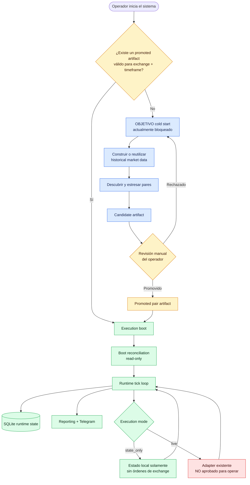
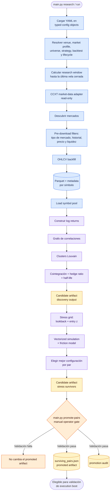
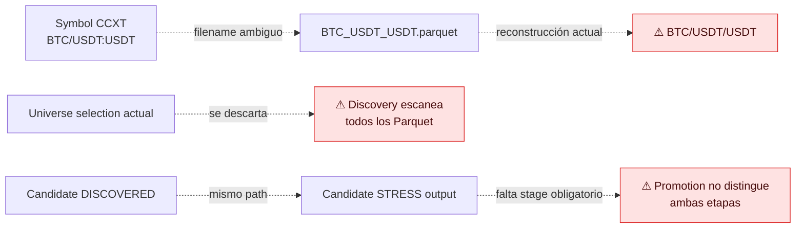
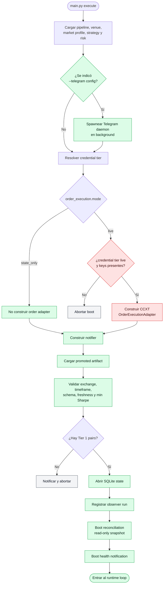
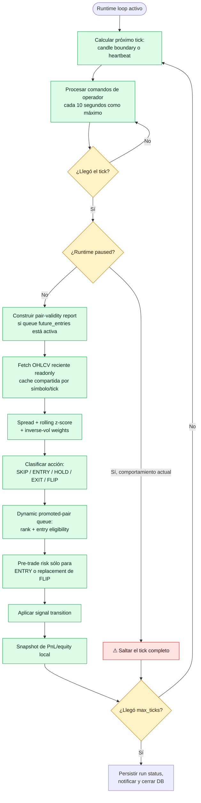
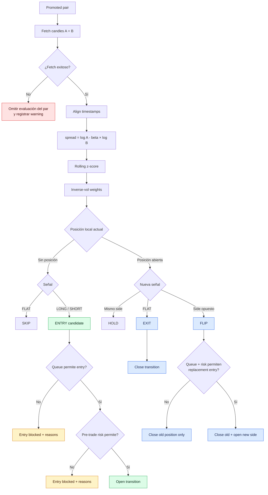
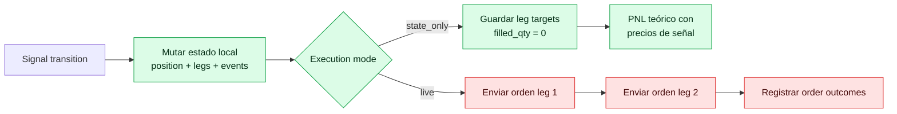
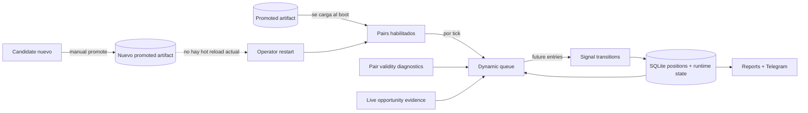

# Trading System Flow

Este documento explica visualmente cómo funciona el sistema en dos situaciones:

1. **Cold start:** todavía no existe un promoted pair artifact utilizable o hay
   que reconstruir los datos de research.
2. **Runtime normal:** el trader ya arrancó, cargó su artifact y está ejecutando
   ticks periódicos.

Combina comportamiento actual con el flujo objetivo necesario para completar un
cold start. Las etiquetas significan:

- **ACTUAL**: comportamiento presente en el código.
- **OBJETIVO**: contrato todavía no demostrado de punta a punta.
- `⚠`: gap identificado en
  [`PROJECT_REENTRY_AUDIT.md`](PROJECT_REENTRY_AUDIT.md).

El orden de corrección está en
[`current-roadmap.md`](current-roadmap.md). Este diagrama no es un
runbook ni habilita `live` o capital real.

## 1. Vista general



La frontera más importante es:

```text
research produce evidencia y artifacts
                    ↓ promoción manual
execution consume únicamente el promoted artifact
                    ↓ sólo mode=live
exchange puede recibir órdenes
```

Research, recalculación de pares, reporting y pair-validity no deben mutar el
exchange.

## 2. Cold start objetivo en detalle

Los entrypoints existen como `python main.py research ...` o
`python main.py run --config ...`, pero la secuencia completa todavía no está
certificada desde un workspace vacío. El siguiente gráfico muestra el contrato
que Milestone 1 debe conseguir, no una receta soportada hoy.



### Qué persiste el cold start

| Resultado | Para qué se usa |
|---|---|
| Parquet OHLCV + metadata | Research, stress y pair-validity diagnostics |
| Candidate artifact | Resultado todavía no autorizado para execution |
| Stress report | Evidencia para revisión del operador |
| Promoted artifact | Único universo que execution carga para nuevas entradas |
| Promotion audit | Quién/cuándo/qué contenido fue promovido |

El reemplazo del promoted artifact es atómico a nivel de archivo, pero el append
del audit sucede después. Hoy no forman una única transición recuperable.

### Gaps actuales que afectan el cold start



Por eso el primer milestone del roadmap corrige identidad de símbolos, manifest
de universo, lifecycle incremental y provenance del candidate antes de agregar
sofisticación estadística.

## 3. Execution boot

El entrypoint es `python main.py execute ...`.



Notas importantes:

- Dev, UAT y prod están configurados hoy como `state_only`.
- La rama `live` muestra código existente, no una ruta aprobada; faltan sizing,
  fill lifecycle, recovery, reconciliación fail-closed y emergency controls.
- Con `--telegram`, Prefect lanza el daemon de comandos como proceso separado;
  durante las esperas el trader consume los comandos persistidos.
- La reconciliación de boot registra y notifica deltas, pero actualmente no
  bloquea el loop.
- El runner aborta antes de abrir SQLite si no encuentra Tier 1 pairs.
- El nombre interno “Live Execution” es confuso: el modo efectivo lo determina
  `order_execution.mode`.

## 4. Qué sucede cuando ya está corriendo



La semántica deseada de `pause` es “bloquear nuevas entradas y permitir exits”.
El código actual retorna antes de evaluar todo el tick, por lo que también pausa
MTM y natural exits. Está marcado como corrección `NOW` en el roadmap.

## 5. Decisión por cada par en un tick



Dos distinciones esenciales:

- Queue, validity, slot limits y pre-trade risk pueden bloquear **entradas
  futuras**; no deberían bloquear un exit.
- Una falla de datos debería producir `NO_DATA/HOLD`, pero hoy algunos casos de
  datos insuficientes se convierten en `FLAT`, que puede parecer un exit real.

## 6. Qué cambia entre `state_only` y `live`



| Modo | Qué hace | Qué no prueba |
|---|---|---|
| `state_only` | Señales, queue, pre-trade gates, posiciones/legs locales, PnL teórico, reporting | Fills, fees, funding, slippage, partial orders, exchange recovery |
| `live` | Agrega órdenes CCXT reales | Aún no está aprobado para capital: el lifecycle local se adelanta a fills y faltan recovery/reconciliation gates |
| Paper stateful | **Todavía no existe**; es el siguiente gran milestone | Se construirá sobre replay determinista y simulated fills |

## 7. Artifacts y estado durante el runtime



Mientras el proceso corre:

- No se ejecuta research automáticamente.
- No hay hot reload del promoted artifact.
- Un candidate nuevo no cambia el universo activo hasta promoción + restart.
- Pair validity y dynamic queue recalculan evidencia de entradas futuras.
- SQLite persiste posiciones, legs, señales, equity, comandos, runs y
  reconciliación.

La intención segura es que una posición abierta conserve sus parámetros y salga
naturalmente aunque el par desaparezca del artifact siguiente. El código actual
todavía no persiste todo ese contrato ni une correctamente posiciones huérfanas
al boot; por eso aparece como gap prioritario en el roadmap.

## 8. Resumen operativo

### Cold start objetivo — todavía no soportado de punta a punta

```text
typed configs
-> readonly market discovery
-> filtered OHLCV backfill
-> local Parquet
-> returns / clusters / cointegration
-> candidate
-> vector stress
-> candidate survivors
-> manual promotion
-> promoted artifact
-> execution boot
```

### Ya corriendo

```text
sleep while processing commands
-> pair validity
-> fetch recent candles
-> signal per pair
-> dynamic queue
-> pre-trade risk for entries
-> local transition
-> optional live orders only in explicit live mode
-> equity/reporting
-> next tick
```

### Progresión real del producto

```text
state_only actual
-> paper stateful con simulated fills
-> exchange demo/testnet
-> very-small-capital canary
-> producción sólo después del readiness gate
```

El sistema está hoy entre el primer y el segundo escalón.
